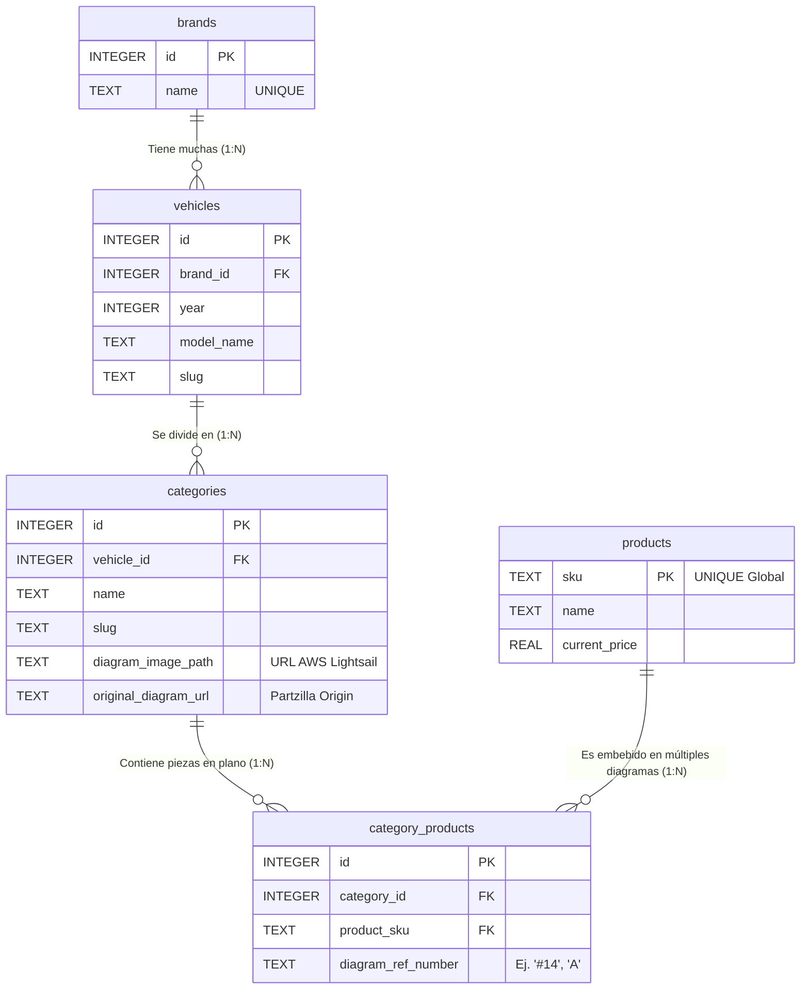

# Esquema y Relaciones de la Base de Datos Motopillos

Este documento describe la arquitectura relacional diseñada para el e-commerce de repuestos de motocicletas. 
La base de datos actual opera en **SQLite** (`motopillos_catalog.db`) optimizada para migración directa hacia **PostgreSQL**.

---

## 1. Diagrama de Relación de Entidades (ERD)

---

## 2. Diccionario de Datos (Tablas)

### 2.1 Tabla `brands`
Diccionario maestro de marcas de motocicletas.
* **`id`** (INTEGER, Primary Key): Identificador interno.
* **`name`** (TEXT, Unique): Nombre de la marca (ej. `honda`, `yamaha`).

### 2.2 Tabla `vehicles`
Contiene los modelos y años específicos comercializados.
* **`id`** (INTEGER, Primary Key)
* **`brand_id`** (INTEGER, Foreign Key): Referencia a `brands.id` (CASCADA).
* **`year`** (INTEGER): Año de manufactura (ej. `2010`).
* **`model_name`** (TEXT): Nombre técnico del modelo (ej. `cbr600ra-ac`).
* **`slug`** (TEXT): Identificador seguro para URLs.
* *Restricción:* `UNIQUE(brand_id, year, model_name)` prohíbe duplicar modelos en el mismo año.

### 2.3 Tabla `categories`
Representa los sistemas mecánicos o eléctricos (los diagramas o planos).
* **`id`** (INTEGER, Primary Key)
* **`vehicle_id`** (INTEGER, Foreign Key): Referencia al vehículo dueño.
* **`name`** (TEXT): Nombre humano del plano (ej. `ABS CONTROL UNIT CBR600RA`).
* **`diagram_image_path`** (TEXT): URL pública absoluta generada para visualizar el diagrama desde la nube AWS S3.
* **`original_diagram_url`** (TEXT): Vínculo de reserva hacia la CDN de Partzilla.
* *Restricción:* `UNIQUE(vehicle_id, slug)` evita duplicar planos idénticos.

### 2.4 Tabla `products` (Máster de Catálogo)
El corazón del inventario. A través del esquema relacional, este catálogo colapsa millones de ocurrencias de piezas a una lista plana de ~170,000 SKUs únicos, garantizando que una actualización de precio se esparza a todos los modelos de moto instantáneamente.
* **`sku`** (TEXT, Primary Key): La llave global. Número de parte del fabricante impreso en la bolsa.
* **`name`** (TEXT): Nombre descriptivo general.
* **`current_price`** (REAL): Valor numérico actual proveniente de Partzilla.

### 2.5 Tabla `category_products` (Tabla Pivote o Puente Relacional)
Une los SKUs universales a diagramas particulares de motos particulares.
* **`id`** (INTEGER, Primary Key)
* **`category_id`** (INTEGER, Foreign Key)
* **`product_sku`** (TEXT, Foreign Key)
* **`diagram_ref_number`** (TEXT): El índice alfanumérico impreso en el diagrama `diagram_image_path` que señala con una flecha a este SKU (ej. el tornillo `#14`).

---

## 3. Índices (Indexación Creada para Performance)
Para garantizar tiempos de respuesta de latencia casi cero en el portal web de millones de refacciones, se inyectaron índices B-Tree transparentes:
- `idx_vehicle_brand`: Busca motos instantáneamente al cliquear en una Marca.
- `idx_vehicle_year`: Busca modelos instantáneamente al cliquear en un Año.
- `idx_category_vehicle`: Lista todos los diagramas de una moto sin sobrecarga.
- `idx_cat_prod_cat` e `idx_cat_prod_sku`: Resolutores de doble vía para encontrar qué motos soportan una pieza o qué piezas requiere una moto.
