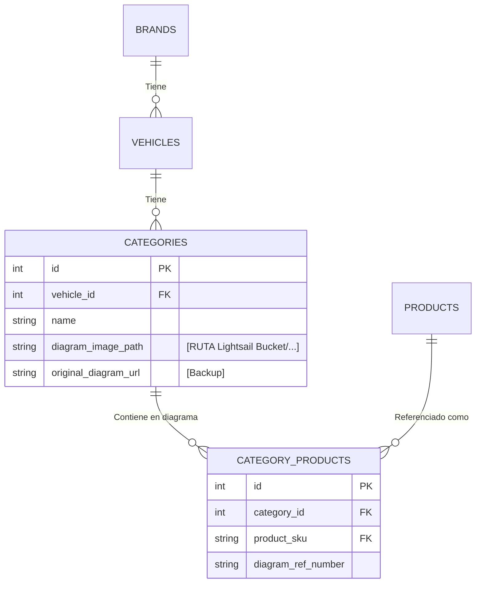

# Documentación Técnica: Scraper, AWS S3 y Base de Datos Motopillos

Este documento sirve como manual de ingeniería local para mantener, actualizar y escalar el motor de datos y diagramas.

---

## 1. Auditoría de Seguridad y Vulnerabilidades

- **[PROTEGIDO] Prevención de Inyección SQL (SQLi):** Uso de métodos parametrizados. Ninguna inyección desde un JSON.
- **[LIMITADO] Prevención de Traversal Path:** Contención al sistema de archivos local.
- **[SEGURO] Open CV Rendering:** Los diagramas se reconstruyen matemáticamente eliminando inyecciones virales desde el renderizado nativo.
- **[SEGURO CONTRA GIT CRASH] Protección S3 Automática:** Las carpetas masivas de gráficos generativos (`s3_images/`) y los motores de SQLite (`*.db`) están bloqueados con el `.gitignore`, imposibilitando la ruptura de tu repositorio Git en GitLab/GitHub.

---

## 2. Mapa Racional y Configuración Cloud



La base de datos SQLite actual tiene optimizadas sus rutas apuntando a **Keys Universales** (ej. `honda/motorcycle/2010...`).
Para tu aplicación front-end (*NextJS/React*), la visualización de la imagen se formará de la siguiente forma usando tu Lightsail Distribution / Bucket URL:

```js
const imageUrl = `https://${TU_LIGHTSAIL_BUCKET_NAME}.ap-northeast-1.amazonaws.com/${categoria.diagram_image_path}`;
```

---

## 3. Protocolo de Despliegue hacia AWS Lightsail

Las imágenes ahora están aisladas en la carpeta unificada `motopillos/lightsail_images/`.
Para mandarlas a Amazon Lightsail sin sobrecargar tu RAM, primero debes obtener tus credenciales (Access Key y Secret Key en AWS IAM o Consola de Lightsail) y seguir este proceso en terminal usando AWS CLI v2:

```bash
# 1. Configurar credenciales:
aws configure

# 2. Despliegue Paralelo Directo hacia el Lightsail Bucket (Ajustar Region/Endpoint si no es us-east-1):
aws s3 sync /Ruta/A/Tu/Proyecto/lightsail_images/ s3://NOMBRE_DE_TU_BUCKET_LIGHTSAIL/ --exclude "*" --include "*.png" --acl public-read
```
*Este comando S3 SYNC es nativamente compatible con Lightsail. Tomará literalmente todo tu árbol `honda/motorcycle/...` y lo replicará en tu Bucket de inmediato consumiendo mínima RAM local.*

---

## 4. Updates Anuales y de Precios UPSERTS

**Escenario A: Añadir años futuros o Diagramas nuevos**
1. Lanzar el Scraper.
2. Limpiar imágenes (Fondo Blanco).
3. Correr `rescue_images.py` para añadir el remanente nuevo a la bóveda local `lightsail_images`.
4. Run `aws s3 sync` again (El comando sincronizará y enviará hacia Lightsail sólo las nuevas omitiendo las viejas).
5. Ejecutar `mega_ingestor.py`. UPSERT inyectará el nuevo inventario a la base de datos sin duplicar registros pasados.

**Escenario B: Price Drops**
1. Descarga selectiva.
2. Disparar Ingestor (`mega_ingestor.py`) $\rightarrow$ Aplica la condición `ON CONFLICT DO UPDATE SET current_price`.
